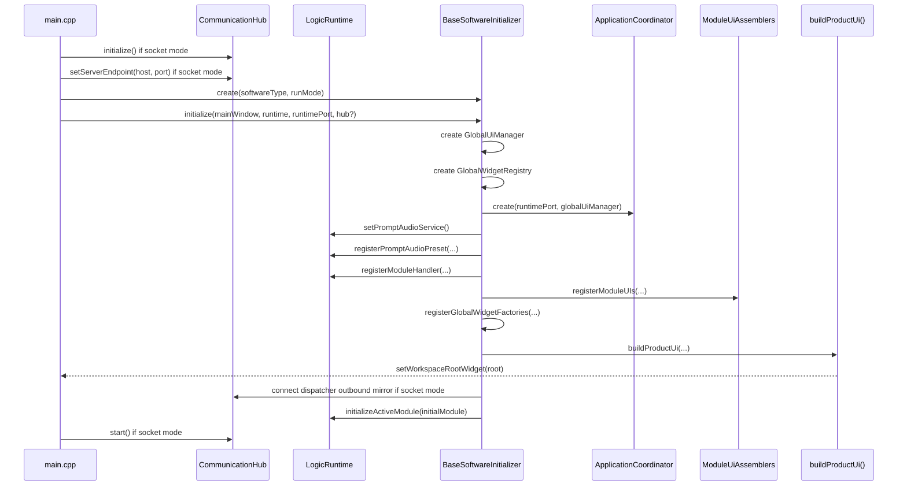

# 启动与装配规范

## 目标

本章定义系统从进程启动到进入初始模块的完整装配路径，并明确当前版本中产品定义、模块包注册、共享运行时与产品目标之间的职责分界。

## 启动入口

当前启动链路已经进入“共享启动器 + 多产品入口 + 产品定义驱动装配”的实现状态。

- 共享启动器位于 [../src/app/bootstrap/ApplicationLauncher.cpp](../src/app/bootstrap/ApplicationLauncher.cpp)。
- 默认产品兼容入口位于 [../src/main.cpp](../src/main.cpp)。
- planning_navigation 产品入口位于 [../src/products/planning_navigation/main.cpp](../src/products/planning_navigation/main.cpp)。

产品入口主函数统一委托给共享启动器。共享启动器执行顺序如下：

1. 设置 Qt/VTK 默认 SurfaceFormat。
2. 创建 QApplication。
3. 解析命令行参数。
4. 判定运行模式：Local 或 Socket。
5. 创建 LogicRuntime。
6. 如果是 Socket 模式，创建 CommunicationHub 并调用 initialize()。
7. 如果是 Socket 模式，设置 Socket 服务端地址与端口。
8. 先读取产品自带的默认 profile 资源，再合并外部 software profile 与命令行样式覆盖。
9. 创建并配置 AppStyleManager。
10. 创建 MainWindow。
11. 通过 ProductDefinition 注册本产品所需的 ModulePack，并创建 ProductSoftwareInitializer。
12. 调用 initializer->initialize() 完成系统装配，其中 LogicRuntime 同时作为运行时和 ILogicRuntimePort 注入。
13. 如果是 Socket 模式，启动 CommunicationHub。
14. 显示主窗口并进入事件循环。
15. 退出前停止 CommunicationHub。

### 当前产品入口

| 产品 target | 默认 softwareType | 入口文件 |
| --- | --- | --- |
| VTKQtCore | default | [../src/main.cpp](../src/main.cpp) |
| VTKQtCorePlanningNavigation | planning_navigation | [../src/products/planning_navigation/main.cpp](../src/products/planning_navigation/main.cpp) |

### 当前产品资源与打包目标

| 产品 target | 默认 profile 资源 | 窗口图标资源 | 打包目标 |
| --- | --- | --- | --- |
| VTKQtCore | [../src/products/default/product.json](../src/products/default/product.json) | [../src/products/default/resources/app-window-icon.svg](../src/products/default/resources/app-window-icon.svg) | VTKQtCore_package |
| VTKQtCorePlanningNavigation | [../src/products/planning_navigation/product.json](../src/products/planning_navigation/product.json) | [../src/products/planning_navigation/resources/app-window-icon.svg](../src/products/planning_navigation/resources/app-window-icon.svg) | VTKQtCorePlanningNavigation_package |

## 启动参数

| 参数 | 类型 | 默认值 | 作用 |
| --- | --- | --- | --- |
| --local | 标志位 | false | 使用本地模式，不启动 Socket 通信 |
| --socket-host | 字符串 | 127.0.0.1 | Socket 服务端地址 |
| --socket-port | 无符号整数 | 9000 | Socket 服务端端口 |
| --software-profile | 文件路径 | 空 | 软件配置文件路径 |
| --software-type | 字符串 | 无 | 预留给兼容场景；当前产品入口固定 ProductDefinition，不通过命令行跨产品切换 |
| --style-theme | 字符串 | clinical-light | 指定主题样式 ID |

### 端口容错

socket-port 解析失败或为 0 时，系统会回退到 9000，并写入启动警告日志。

## Software Profile 结构

当前代码实际读取到的 profile 字段至少包括：

| 字段名 | 类型 | 含义 |
| --- | --- | --- |
| softwareType | string | 软件类型，优先于 initializer 字段 |
| initializer | string | 兼容字段，可作为 softwareType 的后备 |
| styleTheme | string | 样式主题 |
| globalStyleTheme | string | 兼容字段，可作为 styleTheme 的后备 |
| enabledModules | string[] | 启用模块列表 |
| moduleDisplayOrder | string[] | 模块显示顺序 |
| workflowSequence | string[] | moduleDisplayOrder 的兼容替代字段 |
| initialModule | string | 初始模块 |
| communication.routingChannels | string[] | 下行路由频道 |
| communication.controlPublishChannel | string | 上行控制频道 |
| communication.ackChannel | string | ACK 频道 |

推荐 profile 结构：

```json
{
	"softwareType": "default",
	"styleTheme": "clinical-light",
	"enabledModules": ["datagen", "params", "pointpick", "planning", "navigation"],
	"moduleDisplayOrder": ["datagen", "params", "pointpick", "planning", "navigation"],
	"initialModule": "datagen",
	"communication": {
		"routingChannels": ["control.downstream"],
		"controlPublishChannel": "control.upstream",
		"ackChannel": "control.ack"
	}
}
```

## 运行模式

| 模式 | 条件 | 行为 |
| --- | --- | --- |
| Local | 存在 --local | 不创建 CommunicationHub；UI 动作直接进入 LogicRuntime |
| Socket | 默认 | 创建并启动 CommunicationHub；UI 动作先本地进入 LogicRuntime，再按需镜像外发到 socket |

## 样式初始化

样式管理由 [../src/ui/globalui/AppStyleManager.h](../src/ui/globalui/AppStyleManager.h) 完成。当前 main.cpp 固定注册：

- styleId: clinical-light
- 资源路径: :/styles/styles/app-theme.qss

样式选择规则：

1. 如果 profile 或命令行指定了 styleTheme，则优先应用。
2. 如果指定样式不可用或未指定，则回退到 clinical-light。

## ProductDefinition 与 ProductSoftwareInitializer

当前主路径不再依赖 SoftwareInitializerFactory 选择具体产品 initializer，而是采用：

- ProductDefinition：描述产品标识、显示名、默认 profile 资源、窗口图标资源、默认模块列表与模块注册入口。
- ProductSoftwareInitializer：承接 BaseSoftwareInitializer 生命周期骨架，并按 ProductDefinition 与合并后的 software profile 装配模块。
- ModulePackRegistry：承接具体业务模块的逻辑注册和 UI 装配入口。

当前真实启动顺序为：

1. 产品入口构造 ProductDefinition。
2. 共享启动器加载默认 profile 资源并合并外部 profile。
3. 共享启动器调用 ProductDefinition::registerModulePacks。
4. 创建 ProductSoftwareInitializer。
5. ProductSoftwareInitializer 在 initialize() 中遍历 configuredEnabledModules()，按 ModulePackRegistry 装配逻辑与 UI。

## MainWindow 骨架

MainWindow 当前只承担根窗口职责，不再内建 WorkspaceShell。它负责：

- 持有 rootStack。
- 接收 initializer 提供的 workspaceRootWidget。
- 持有 globalOverlayLayer。
- 持有 globalToolHost。
- 持有 GlobalWidgetRegistry 指针入口。

MainWindow 不再决定产品布局结构。

## BaseSoftwareInitializer 骨架

BaseSoftwareInitializer 的职责不是实现某个软件，而是固定装配顺序，同时把具体 UI 骨架定义权下放给具体 initializer。其 initialize() 当前真实顺序如下：

1. 解析 configuredInitialModule()。
2. 创建 GlobalUiManager，并绑定全局 overlay 和 tool host。
3. 创建 GlobalWidgetRegistry，并挂到 MainWindow。
4. 创建不依赖固定壳层的 ApplicationCoordinator。
5. 获取 ActiveModuleState，并设置初始模块和空当前模块。
6. 创建 PromptAudioService 并注入 LogicRuntime。
7. 注册音频预设：polling_progress、polling_attention。
8. 调用 registerModuleLogicHandlers() 注册所有模块逻辑处理器。
9. 调用 registerModuleUIs() 创建模块页面、模块协调器和补充视图。
10. 调用 registerGlobalWidgetFactories() 登记产品级全局控件工厂。
11. 调用 buildProductUi() 构建具体产品根 QWidget 树，并挂到 MainWindow。
12. 调用 configureAdditionalSettings()。
13. 如果为 Socket 模式，则把所有已创建的 UiActionDispatcher 的 action/resync 输出镜像连接到 CommunicationHub。
14. 调用 registerCommunicationSources()。
15. 把 LogicRuntime::logicNotification 连接到 ApplicationCoordinator::onShellNotification()。
16. 如果为 Socket 模式，则把 CommunicationHub 的 control/serverCommand/stateSample/error/issue/health/connectionState 相关信号连接到 LogicRuntime。
17. 通过 LogicRuntime::initializeActiveModule() 直接激活初始模块，而不是通过固定壳层动作路径切换页面。

### BaseSoftwareInitializer 的公开/扩展点

| 方法 | 角色 |
| --- | --- |
| getEnabledModules() | 默认启用模块列表 |
| getModuleDisplayOrder() | 默认显示顺序 |
| getInitialModule() | 默认初始模块 |
| registerModuleLogicHandlers() | 注册逻辑处理器 |
| registerModuleUIs() | 注册模块页面与模块协调器 |
| registerGlobalWidgetFactories() | 注册全局控件工厂 |
| buildProductUi() | 构建产品根界面 |
| registerCommunicationSources() | 配置 CommunicationHub 源 |
| configureAdditionalSettings() | 追加软件级设置 |

### 配置优先级

#### enabledModules

- 先取 profile.enabledModules
- 如果为空，回退到 getEnabledModules()
- 只保留默认模块列表中存在的项

#### moduleDisplayOrder

- 先取 profile.moduleDisplayOrder
- 若为空，取 profile.workflowSequence
- 再为空，取 getModuleDisplayOrder()
- 只保留启用模块
- 对启用但未出现在顺序列表中的模块追加到末尾

#### initialModule

- 先取 profile.initialModule
- 无效则取 getInitialModule()
- 仍无效则取显示顺序中的第一个模块

## ProductSoftwareInitializer

当前产品装配主实现位于 [../src/app/software/ProductSoftwareInitializer.cpp](../src/app/software/ProductSoftwareInitializer.cpp)。它负责默认产品根界面、全局控件工厂、通信源配置和按模块包遍历装配。

### 当前默认产品根界面

当前产品壳层会统一登记：

- intermodule.sender
- intermodule.receiver

当前产品壳层统一构建的界面布局为：

- 顶部：InterModuleSenderWidget 与 InterModuleReceiverWidget
- 中央：QStackedWidget 形式的模块主页面区
- 右侧：ModuleNavigationModule 与当前模块补充视图
- 底部：ModuleStatusBarModule

模块差异不再写死在 ProductSoftwareInitializer 内部，而是由产品目标链接的 ModulePack 和产品 profile 决定。

## ModuleUiAssemblers 规则

模块 UI 由 [../src/app/software/ModuleUiAssemblers.cpp](../src/app/software/ModuleUiAssemblers.cpp) 统一创建。上下文结构当前固定包含：

- LogicRuntime* runtime
- ApplicationCoordinator* applicationCoordinator
- ILogicRuntimePort* runtimePort
- GlobalUiManager* globalUiManager
- GlobalWidgetRegistry* globalWidgetRegistry

任何模块 UI 装配函数都应遵守以下顺序：

1. 校验上下文有效性。
2. 创建 ModuleCoordinator(moduleId, runtimePort, applicationCoordinator)。
3. 创建 Page。
4. 为 Page 注入 coordinator->getActionDispatcher()。
5. 如有需要，创建补充视图并通过 addSupplementaryView() 注册。
6. 如有需要，创建 VtkSceneWindow，并把 SceneGraph 注入页面。
7. 调用 coordinator->setMainPage(page)。
8. 调用 applicationCoordinator->registerModuleCoordinator(coordinator)。
9. 连接 notificationForPage 到页面更新逻辑。
10. 如存在 VTK 窗口，连接 activated 到 requestReconcile。

## 各主模块 UI 装配特征

| 模块 | 页面 | 补充视图 | VTK 窗口 |
| --- | --- | --- | --- |
| params | ParamsPage | 参数摘要视图 | 无 |
| datagen | DataGenPage | 数据摘要视图 | datagen_main |
| pointpick | PointPickPage | 点选状态视图 | 无 |
| planning | PlanningPage | 规划摘要视图 | planning_main, planning_overview |
| navigation | NavigationPage | 导航摘要视图 | navigation_main |

当前默认产品把这些补充视图挂到右侧面板，但这只是默认产品布局选择。

## VTK 窗口初始化事实

当前装配阶段就会为以下模块设置初始相机参数并立即调用 reconcile()：

- datagen_main
- planning_main
- planning_overview
- navigation_main

只要存在 GlobalUiManager，这些窗口都会通过 registerVtkWindow() 登记到全局 UI 服务。

## 启动时序图



## 启动阶段冻结项

以下名字和行为应视为公开稳定事实：

- --local、--socket-host、--socket-port、--software-profile、--software-type、--style-theme
- softwareType、initializer、styleTheme、globalStyleTheme、enabledModules、moduleDisplayOrder、workflowSequence、initialModule
- control.downstream、control.upstream、control.ack
- clinical-light
- polling_progress、polling_attention
- workspaceRootWidget、GlobalUiManager、GlobalWidgetRegistry、buildProductUi()

以下概念不再属于冻结项：

- WorkspaceShell
- centerStack / rightShellHost / bottomShellHost
- PageManager 作为默认启动链路宿主
