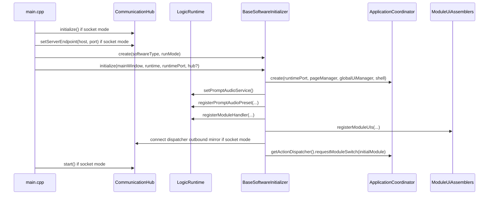

# 启动与装配规范

## 目标

本章定义系统从进程启动到进入初始模块的完整装配路径，明确哪些对象在启动阶段被创建、初始化、连接和激活。

## 启动入口

启动入口固定为 [../src/main.cpp](../src/main.cpp)。主函数执行顺序如下：

1. 设置 Qt/VTK 默认 SurfaceFormat。
2. 创建 QApplication。
3. 解析命令行参数。
4. 判定运行模式：Local 或 Socket。
5. 创建 LogicRuntime。
6. 如果是 Socket 模式，创建 CommunicationHub 并调用 initialize()。
7. 如果是 Socket 模式，设置 Socket 服务端地址与端口。
8. 读取 software profile，并用命令行参数覆盖 profile 中的 softwareType 和 styleTheme。
9. 创建并配置 AppStyleManager。
10. 创建 MainWindow。
11. 通过 SoftwareInitializerFactory::create() 创建具体的 BaseSoftwareInitializer 子类。
12. 调用 initializer->initialize() 完成系统装配，其中 LogicRuntime 同时作为运行时和 ILogicRuntimePort 注入。
13. 如果是 Socket 模式，启动 CommunicationHub。
14. 显示主窗口并进入事件循环。
15. 退出前停止 CommunicationHub。

## 启动参数

| 参数 | 类型 | 默认值 | 作用 |
| --- | --- | --- | --- |
| --local | 标志位 | false | 使用本地模式，不启动 Socket 通信 |
| --socket-host | 字符串 | 127.0.0.1 | Socket 服务端地址 |
| --socket-port | 无符号整数 | 9000 | Socket 服务端端口 |
| --software-profile | 文件路径 | 空 | 软件配置文件路径 |
| --software-type | 字符串 | default | 指定初始化器类型 |
| --style-theme | 字符串 | clinical-light | 指定主题样式 ID |

### 端口容错

socket-port 解析失败或为 0 时，系统会回退到 9000，并写入启动警告日志。

## Software Profile 结构

当前代码实际读取到的 profile 字段至少包括：

| 字段名 | 类型 | 含义 |
| --- | --- | --- |
| softwareType | string | 软件类型，优先于 initializer 字段 |
| initializer | string | 兼容字段，可作为 softwareType 的后备 |
| styleTheme | string | 样式主题 |
| globalStyleTheme | string | 兼容字段，可作为 styleTheme 的后备 |
| enabledModules | string[] | 启用模块列表 |
| moduleDisplayOrder | string[] | 模块显示顺序 |
| workflowSequence | string[] | moduleDisplayOrder 的兼容替代字段 |
| initialModule | string | 初始模块 |
| communication.routingChannels | string[] | 下行路由频道 |
| communication.controlPublishChannel | string | 上行控制频道 |
| communication.ackChannel | string | ACK 频道 |

推荐 profile 结构：

```json
{
	"softwareType": "default",
	"styleTheme": "clinical-light",
	"enabledModules": ["datagen", "params", "pointpick", "planning", "navigation"],
	"moduleDisplayOrder": ["datagen", "params", "pointpick", "planning", "navigation"],
	"initialModule": "datagen",
	"communication": {
		"routingChannels": ["control.downstream"],
		"controlPublishChannel": "control.upstream",
		"ackChannel": "control.ack"
	}
}
```

## 运行模式

| 模式 | 条件 | 行为 |
| --- | --- | --- |
| Local | 存在 --local | 不创建 CommunicationHub；UI 动作直接进入 LogicRuntime |
| Socket | 默认 | 创建并启动 CommunicationHub；UI 动作先本地进入 LogicRuntime，再按需镜像外发到 socket |

## 样式初始化

样式管理由 [../src/ui/globalui/AppStyleManager.h](../src/ui/globalui/AppStyleManager.h) 完成。当前 main.cpp 固定注册：

- styleId: clinical-light
- 资源路径: :/styles/styles/app-theme.qss

样式选择规则：

1. 如果 profile 或命令行指定了 styleTheme，则优先应用。
2. 如果指定样式不可用或未指定，则回退到 clinical-light。

## SoftwareInitializerFactory

SoftwareInitializerFactory 负责根据 softwareType 创建具体装配器。约束如下：

- 对外入口为 create(softwareType, runMode, parent)。
- 具体初始化器通过静态注册方式登记。
- 默认实现由 DefaultSoftwareInitializer 注册为 default。

## BaseSoftwareInitializer 骨架

BaseSoftwareInitializer 的职责不是实现某个软件，而是固定整个装配步骤。其 initialize() 的真实顺序如下：

1. 解析 configuredModuleDisplayOrder() 和 configuredInitialModule()。
2. 创建 PageManager，并绑定 WorkspaceShell::getCenterStack()。
3. 创建 GlobalUiManager，并绑定全局 overlay 和 tool host。
4. 创建 ApplicationCoordinator。
5. 获取 ActiveModuleState，并设置初始模块和空当前模块。
6. 创建 PromptAudioService 并注入 LogicRuntime。
7. 注册音频预设：polling_progress、polling_attention。
8. 调用 registerModuleLogicHandlers() 注册所有模块逻辑处理器。
9. 调用 registerModuleUIs() 装配各模块 UI。
10. 调用 registerShellModules() 装配可选壳层模块。
11. 调用 configureAdditionalSettings()。
12. 如果为 Socket 模式，则把所有已创建的 UiActionDispatcher 的 action/resync 输出镜像连接到 CommunicationHub。
13. 调用 registerCommunicationSources()。
14. 把 LogicRuntime::logicNotification 连接到 ApplicationCoordinator::onShellNotification()。
15. 如果为 Socket 模式，则把 CommunicationHub 的 control/serverCommand/stateSample/error/issue/health/connectionState 相关信号连接到 LogicRuntime。
16. 用 ApplicationCoordinator 持有的 UiActionDispatcher 走标准模块切换路径，进入初始模块。

### BaseSoftwareInitializer 的公开/扩展点

| 方法 | 角色 |
| --- | --- |
| getEnabledModules() | 默认启用模块列表 |
| getModuleDisplayOrder() | 默认显示顺序 |
| getInitialModule() | 默认初始模块 |
| registerModuleLogicHandlers() | 注册逻辑处理器 |
| registerModuleUIs() | 注册页面和模块协调器 |
| registerShellModules() | 注册壳层扩展 |
| registerCommunicationSources() | 配置 CommunicationHub 源 |
| configureAdditionalSettings() | 追加软件级设置 |

### 配置优先级

#### enabledModules

- 先取 profile.enabledModules
- 如果为空，回退到 getEnabledModules()
- 只保留默认模块列表中存在的项

#### moduleDisplayOrder

- 先取 profile.moduleDisplayOrder
- 若为空，取 profile.workflowSequence
- 再为空，取 getModuleDisplayOrder()
- 只保留启用模块
- 对启用但未出现在顺序列表中的模块追加到末尾

#### initialModule

- 先取 profile.initialModule
- 无效则取 getInitialModule()
- 仍无效则取显示顺序中的第一个模块

## DefaultSoftwareInitializer

默认软件装配器位于 [../src/app/software/ConcreteSoftwareInitializers/DefaultSoftwareInitializer.cpp](../src/app/software/ConcreteSoftwareInitializers/DefaultSoftwareInitializer.cpp)。

### 当前默认模块配置

| 配置项 | 值 |
| --- | --- |
| enabledModules | datagen, params, pointpick, planning, navigation |
| moduleDisplayOrder | datagen, params, pointpick, planning, navigation |
| initialModule | datagen |

### 逻辑处理器注册

默认初始化器当前注册：

- InterModuleSenderLogicHandler
- InterModuleReceiverLogicHandler
- DataGenModuleLogicHandler
- ParamsModuleLogicHandler
- PointPickModuleLogicHandler
- PlanningModuleLogicHandler
- NavigationModuleLogicHandler

### UI 装配

默认初始化器当前装配：

- datagen
- params
- pointpick
- planning
- navigation

### 壳层模块装配

当前默认初始化器会在 WorkspaceShell 中装配：

- ModuleNavigationModule
- ModuleStatusBarModule
- 顶部 InterModuleSenderWidget
- 顶部 InterModuleReceiverWidget

## ModuleUiAssemblers 规则

模块 UI 由 [../src/app/software/ModuleUiAssemblers.cpp](../src/app/software/ModuleUiAssemblers.cpp) 统一创建。上下文结构固定包含：

- MainWindow* mainWindow
- LogicRuntime* runtime
- ApplicationCoordinator* applicationCoordinator
- ILogicRuntimePort* runtimePort
- PageManager* pageManager
- GlobalUiManager* globalUiManager

任何模块 UI 装配函数都应遵守以下顺序：

1. 校验上下文有效性。
2. 创建 ModuleCoordinator(moduleId, runtimePort, applicationCoordinator)。
3. 创建 Page。
4. 为 Page 注入 coordinator->getActionDispatcher()。
5. 如有需要，创建辅助面板并通过 addAuxiliaryWidget() 注册。
6. 如有需要，创建 VtkSceneWindow，并把 SceneGraph 注入页面。
7. 调用 coordinator->setMainPage(page)。
8. 调用 pageManager->registerPage(moduleId, page)。
9. 调用 applicationCoordinator->registerModuleCoordinator(coordinator)。
10. 连接 notificationForPage 到页面更新逻辑。
11. 如存在 VTK 窗口，连接 activated 到 requestReconcile。

## 各主模块 UI 装配特征

| 模块 | 页面 | 辅助区 | VTK 窗口 |
| --- | --- | --- | --- |
| params | ParamsPage | Right 摘要面板 | 无 |
| datagen | DataGenPage | Right 摘要面板 | datagen_main |
| pointpick | PointPickPage | Right 状态面板 | 无 |
| planning | PlanningPage | Right 摘要面板 | planning_main, planning_overview |
| navigation | NavigationPage | Right 摘要面板 | navigation_main |

## VTK 窗口初始化事实

当前装配阶段就会为以下模块设置初始相机参数并立即调用 reconcile()：

- datagen_main
- planning_main
- planning_overview
- navigation_main

只要存在 globalUiManager，这些窗口都会通过 registerVtkWindow() 登记到全局 UI 管理器。

## PageManager

PageManager 负责 moduleId 到 QWidget 的页面映射，核心方法为：

- setStackWidget(QStackedWidget*)
- registerPage(moduleId, QWidget*)
- switchToPage(moduleId)
- getCurrentPage()
- getPage(moduleId)

规范要求：

- registerPage() 的 key 必须与模块注册名一致。
- 页面切换不得绕开 PageManager 直接操作中心栈。

## GlobalUiManager

GlobalUiManager 负责三类能力：

- 全局通知与确认对话框
- overlay/mask
- VTK 窗口注册表

其关键公开方法包括：

- showNotification()
- hideNotification()
- showConfirmation()
- showOverlay()
- hideOverlay()
- registerVtkWindow()
- unregisterVtkWindow()
- getVtkWindow()
- showError()

## WorkspaceShell 布局

WorkspaceShell 是整个 UI 壳层容器，提供以下固定挂载点：

- getTopWidget()
- getCenterStack()
- getRightWidget()
- getBottomWidget()
- getRightShellHost()
- getBottomShellHost()

同时还负责辅助区挂载：

- mountRightAuxiliary()
- unmountRightAuxiliary()
- clearRightAuxiliary()
- mountBottomAuxiliary()
- unmountBottomAuxiliary()
- clearBottomAuxiliary()

## 启动时序图



## 启动阶段冻结项

以下名字和行为应视为公开稳定事实：

- --local、--socket-host、--socket-port、--software-profile、--software-type、--style-theme
- softwareType、initializer、styleTheme、globalStyleTheme、enabledModules、moduleDisplayOrder、workflowSequence、initialModule
- control.downstream、control.upstream、control.ack
- clinical-light
- polling_progress、polling_attention
- requestModuleSwitch(initialModule) 作为进入初始模块的标准路径

