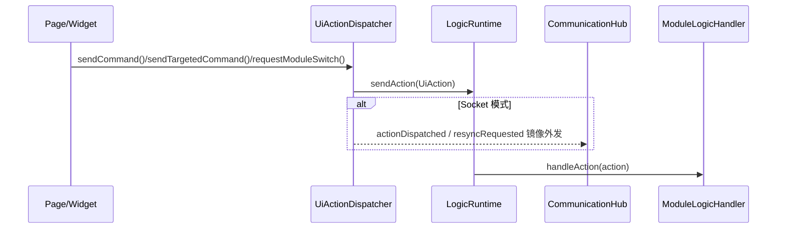
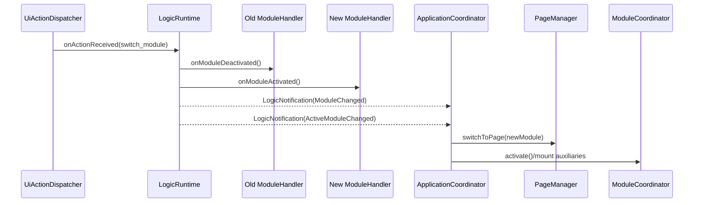

# 运行时与生命周期规范

## 目标

本章定义 LogicRuntime、ILogicRuntimePort、ModuleLogicRegistry、UiActionDispatcher、ApplicationCoordinator、ModuleCoordinator 之间的真实调用关系，以及模块激活、消息投递、重同步和错误处理的生命周期规则。

## 核运行时对象

### LogicRuntime

LogicRuntime 是逻辑协调核心，公开职责包括：

- 持有 SceneGraph
- 持有 ActiveModuleState
- 持有 ModuleLogicRegistry
- 实现 ILogicRuntimePort
- 接收 UI 动作、通信消息、状态样本和错误事件
- 触发模块切换和重同步
- 直接完成模块 action/state 路由
- 提供 invokeModule() 和提示音播放入口

其关键公开槽函数：

- onActionReceived(const UiAction&)
- onControlMessageReceived(const QString& module, const QVariantMap& payload)
- onServerCommandReceived(const QString& commandType, const QVariantMap& payload)
- onStateSampleReceived(const StateSample&)
- onCommunicationError(...)
- onCommunicationIssue(...)
- onCommunicationHealthChanged(...)
- onConnectionStateChanged(const QString& state)
- requestResync(const QString& reason)
- onModulePollBatch(const QString& module, const QVariantMap& values)
- onModuleSubscription(const QString& module, const QString& channel, const QVariantMap& payload)

### ILogicRuntimePort

ILogicRuntimePort 是 UI 到运行时的最小边界，当前只公开两个能力：

- sendAction(const UiAction&)
- requestResync(const QString&)

### ApplicationCoordinator

ApplicationCoordinator 是全局 UI 协调器，负责：

- 持有全局 UiActionDispatcher
- 管理 ModuleCoordinator 注册表
- 处理 shell 级 LogicNotification
- 驱动模块切换
- 维护当前模块 ID

### ModuleCoordinator

ModuleCoordinator 是单模块 UI 协调器，负责：

- 持有模块页面
- 持有模块私有 UiActionDispatcher
- 管理右侧/底部辅助小部件
- 在 activate()/deactivate() 时发出生命周期信号
- 把 LogicNotification 转交给页面

## UI 动作进入运行时的标准路径

## 模块切换生命周期

模块切换是特殊动作，不直接走普通 handler 处理，而由 LogicRuntime::switchToModule() 统一控制。

### 触发方式

- UiActionDispatcher::requestModuleSwitch(targetModule)
- server command 中的 switch_module
- 其他经过标准 onActionReceived() 的 switch_module 指令

### 真实流程

1. LogicRuntime::onActionReceived() 提取 payload[command]。
2. 如果 command 是 switch_module，则解析 payload[targetModule]。
3. 校验目标模块非空且已注册。
4. 若当前模块存在，则调用旧模块 onModuleDeactivated()。
5. 更新 ActiveModuleState::currentModule。
6. 调用新模块 onModuleActivated()。
7. 发出 ModuleChanged 通知。
8. 发出 ActiveModuleChanged 通知。
9. ApplicationCoordinator::onShellNotification() 直接接收 LogicRuntime 通知并检测到 ModuleChanged，执行 setCurrentModule()。
10. setCurrentModule() 负责切页、卸载旧辅助区、挂载新辅助区、激活新 ModuleCoordinator。

### 模块切换时序图

## 普通 UI 意图路由

对非 switch_module 的 UiAction，LogicRuntime 会调用 routeToModuleHandler()，直接完成以下规则：

- 解析目标模块或当前活动模块
- 通过 ModuleLogicRegistry 复用 moduleId / alias 解析
- 目标存在则调用 handler->handleAction(action)
- 目标不存在则发出统一 shell 级错误通知

## 状态样本路由

### StateSample 标准路径

1. CommunicationHub 发出 stateSampleReceived(sample)。
2. LogicRuntime::onStateSampleReceived(sample) 直接解析 sample.module。
3. LogicRuntime 根据 sample.module 定向或广播到模块逻辑处理器。

### global 广播规则

当 sample.module 为 global 时：

- 所有已注册模块都应收到同一份样本
- 比较大小写时应视为不敏感目标

### 轮询批处理

LogicRuntime::onModulePollBatch(module, values) 的规则：

- module 为 global 时，生成一份 global StateSample 并广播给所有已注册模块
- 否则只为目标模块生成一份 StateSample
- sourceId 与 sampleType 当前都使用 poll_batch 风格语义

## 模块事件与定向消息

### UiActionDispatcher 支持的主要发送方式

| 方法 | 作用 |
| --- | --- |
| sendAction(action) | 发送完整 UiAction |
| sendCommand(command, payload) | 面向当前 sourceModule 发送命令 |
| sendTargetedCommand(targetModule, command, payload) | 面向指定模块发送命令 |
| sendToTarget(targetName, command, payload) | 面向任意目标名发送命令 |
| sendModuleUiEvent(targetModule, eventName, payload) | 发送模块 UI 事件 |
| requestModuleSwitch(targetModule) | 请求切换模块 |
| requestResync(reason) | 请求重同步 |

### 模块 UI 事件路径

1. 源模块调用 sendModuleUiEvent(targetModule, eventName, payload)。
2. UiActionDispatcher 构造带有 dispatch_module_ui_event 的 payload。
3. 动作进入 LogicRuntime。
4. 目标模块逻辑处理器决定是更新自身状态、发出 CustomEvent，还是进一步转换为 UI 通知。
5. 页面通过 ModuleUiEvent::isNotification() 识别自己关心的自定义事件。

## shell 与 global-ui 目标域

AppMessage 的目标域存在三种特殊 name：

- global
- shell
- global-ui

含义如下：

- global：广播给所有模块
- shell：发往壳层协调逻辑，如模块切换、状态栏、导航条
- global-ui：发往全局 UI 服务，如通知、overlay、错误展示、工具宿主

## 重同步流程

### 触发方式

- UiActionDispatcher::requestResync(reason)
- CommunicationHub::sendResyncRequest(reason, loopbackToLocal)
- 服务端命令或兼容 envelope 触发的 resync_request / resync_response

### 语义要求

- requestResync() 必须走统一入口，而不是由模块各自发明私有重同步通道。
- 重同步行为应影响所有受影响模块，而不只是当前活动模块。

## 连接状态与错误处理

### 连接状态

CommunicationHub 的 connectionStateChanged(state) 会连接到 LogicRuntime::onConnectionStateChanged(state)。

当前对外可见状态文本至少包括：

- Connected
- Degraded
- Disconnected

### 错误输入源

- onCommunicationError(source, errorMessage)
- onCommunicationIssue(source, severity, errorCode, errorMessage, context)
- onCommunicationHealthChanged(healthSnapshot)

### 错误处理原则

- 运行时错误应收敛成统一 LogicNotification，而不是散落到各页面直接处理。
- 目标不存在、模块切换目标无效、协议字段缺失、通信异常都应形成可追踪的错误事件。
- 错误类通知应携带 sourceActionId 或上下文，便于跨语言实现复刻相同的调试链路。

## ApplicationCoordinator 切换规则

ApplicationCoordinator::setCurrentModule(moduleId) 的核心职责：

1. 停用旧 ModuleCoordinator。
2. 清除 WorkspaceShell 右侧与底部辅助小部件。
3. 调用 PageManager::switchToPage(moduleId)。
4. 激活新 ModuleCoordinator。
5. 挂载新模块的辅助区部件。
6. 发出 currentModuleChanged(moduleId) 信号。

该流程是页面切换唯一标准路径，页面栈和辅助区域不得由外部直接修改。

## 冻结的公开行为

- LogicRuntime 接收动作、状态样本、控制命令和错误事件的入口名称
- ILogicRuntimePort 的 sendAction()/requestResync()
- requestModuleSwitch() 触发 switchToModule()
- ModuleChanged 与 ActiveModuleChanged 在模块切换时成对发出
- PageManager::switchToPage() 与 ApplicationCoordinator::setCurrentModule() 的配合顺序
- global、shell、global-ui 三个目标域含义

